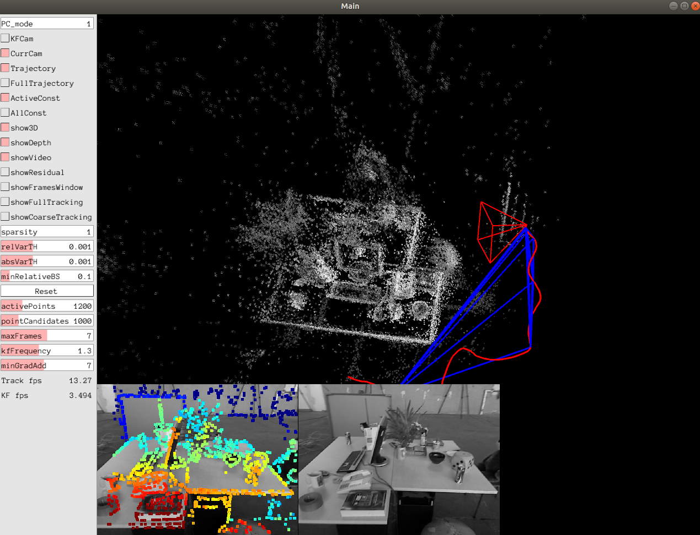

# dso2

This is a simplified version of [dso](https://github.com/JakobEngel/dso), only 2 threads are left, and a bug existing in initialization process is fixed.

### Environment

 - Ubuntu 18.04  
 - Cmake 3.10.2  
 - g++ 7.4.0  
 - OpenCV 4.1.0  
 - Pangolin
 - Eigen3
 - PkgConfig 0.29.1 
 - ziplib  
 - SuiteSparse

### Build

1. build the repo  

```
    $git clone git@github.com:qqadssp/dso2  
    $cd dso2/build  
    $cmake ..  
    $make  
```

2. run

```
    $dso_main calib=./tumrgb/freiburg2.txt  
```

**Datasets**: Please download the imagedata(such as [tum rgbd freiburg2_desk](https://vision.in.tum.de/rgbd/dataset/freiburg2/rgbd_dataset_freiburg2_desk.tgz)) and change the path in `dso_main.cpp`.

### Demo


